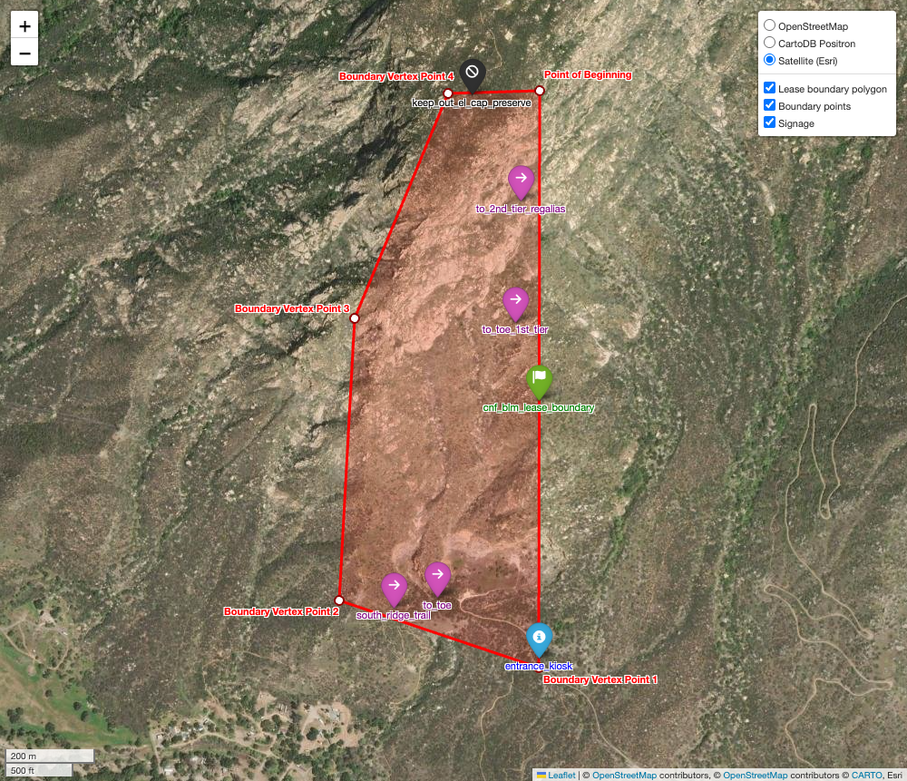

Specify input directly in [the main script](main.py) and then run it to generate land description, shapefiles, etc. 
Some of this is hard-coded, so making structural changes to the inputs may require some fiddling with the code. 

[`map_shapefiles.py`](map_shapefiles.py) should give you an [HTML map](output/lease_map_from_shapefiles.html) to check the shapefile contents and a statically rendered PNG (displayed below). 

# Description of Land

San Bernardino Meridian, California
T. 15 S., R. 1 E.,
sec. 1, NE1/4NE1/4, SE1/4NE1/4, and NE1/4SE1/4,
that portion described as follows:

BEGINNING at Point 0 (POINT OF BEGINNING), having geographic coordinates 32° 54' 6.44" North, 116° 49' 25.39" West;
THENCE, South 00° 05' 3.71" West, a distance of 4169.76 U.S. survey feet, to Point 1;
THENCE, North 71° 31' 49.06" West, a distance of 1527.62 U.S. survey feet, to Point 2;
THENCE, North 03° 05' 55.68" East, a distance of 2044.20 U.S. survey feet, to Point 3;
THENCE, North 22° 41' 7.77" East, a distance of 1758.87 U.S. survey feet, to Point 4;
THENCE, North 88° 07' 19.71" East, a distance of 666.43 U.S. survey feet, returning to the POINT OF BEGINNING.

The area described contains approximately 111 acres.

BASIS OF BEARINGS: Bearings stated herein are geodetic bearings computed
from the listed corner coordinates on the WGS 84 ellipsoid and are referenced
to true (geodetic) north.

COORDINATE REFERENCE:
  CRS: EPSG:4326 (WGS 84 geographic coordinates)
  Datum: WGS 84
  Epoch/Date of adjustment: NOT PROVIDED
  Geoid model: N/A (no elevations used)

QUALIFICATION / LINEAGE:
  Corner coordinates were digitized from online mapping software using government land boundary overlays; coordinates are not from a field survey.
  Positional accuracy: UNKNOWN (digitized / not surveyed)

SUPPORTING TABLES:
  Corner coordinate and course tables are provided as separate CSV files.

## Choices and Methods (supporting documentation)

Goal:
  Produce a draft land description and GIS layers that are reproducible and
  susceptible to one, and only one, interpretation by clearly defining all
  computational and drafting choices.

Key interpretive choices fixed in this package:
  - Point of Beginning: Point 0 (explicitly named and used as the first vertex).
  - Traverse order: Point 0→1→2→3→4→0, enforced to be clockwise.
  - Boundary geometry: straight-line segments connecting successive listed corner coordinates;
    no natural-feature meanders or adjoiner-based calls are implied.
  - CRS: EPSG:4326 (WGS 84). Input coordinates are provided as (lat, lon) but geometries are
    stored as (x=lon, y=lat) per GIS convention to avoid axis-order ambiguity.
  - Bearings and distances: computed geodesically on the WGS 84 ellipsoid between each
    consecutive pair of corner coordinates. Bearings are reported as quadrant bearings.
  - Distance units: us_survey_feet (narrative uses U.S. survey feet if selected).
  - Area: computed as a geodesic polygon area on the ellipsoid; because the corners are digitized,
    acreage is treated as approximate and rounded to the nearest full acre in the description.

Geometry validation performed:
  - Polygon validity: True (valid)
  - Vertex count: 5
  - Computed geodesic area: 111.0340 acres

Known limitations / qualifiers (not resolved by computation):
  - Corner coordinates are not from a field survey; monument descriptions and survey ties are not provided.
  - Epoch/date-of-adjustment for WGS 84 realization is not provided; therefore coordinate epoch is listed
    as NOT PROVIDED.

Files written by this script:
  - description_of_land.txt (draft description)
  - boundary_corners.csv and boundary_courses.csv (tabular support)
  - lease_boundary.shp and lease_points.shp (EPSG:4326)
  - metadata.json (deliverable metadata and field dictionary)